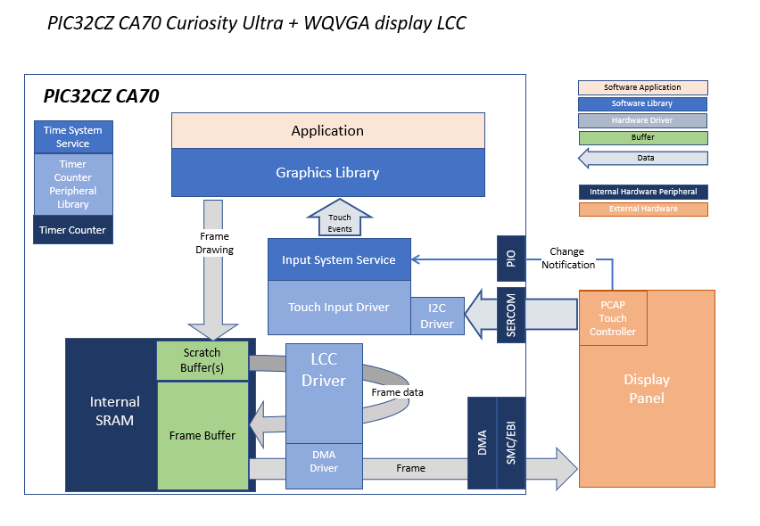
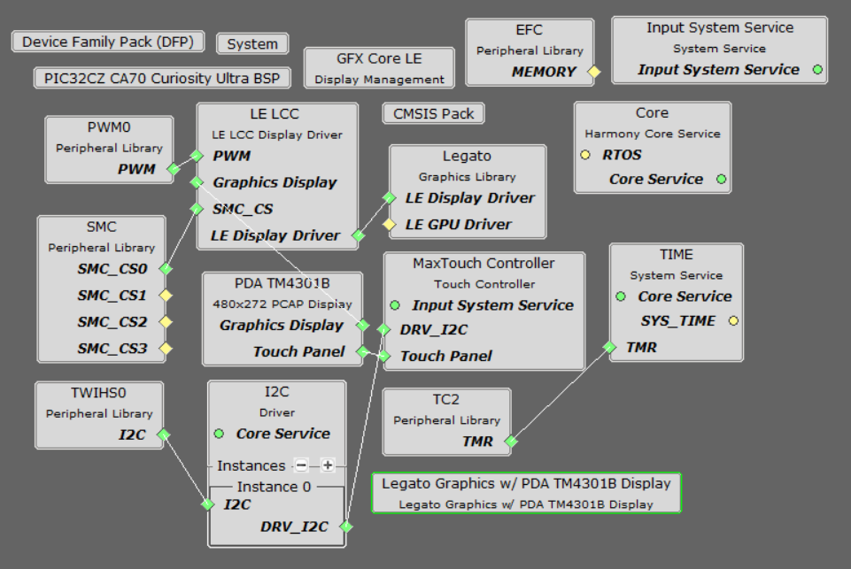

 legato\_qs\_cz\_ca70\_cu\_wqvga.X

Defining the Architecture
-------------------------

This application demonstrates single-layer, WQVGA graphics using SRAM memory.

This configuration runs on the PIC32CZ_CA70 Curiosity Ultra board an RGB565 GFX interface card and 4.3" WQVGA display. The Legato graphics library draws the updated sections of the frame to an internal scratch buffer. The scratch buffer is copied to the main frame buffer which is used to refresh the display thru the Low-Cost Controller-less (LCC) driver.

User touch input on the display panel is received thru the PCAP capacitive touch controller, which sends a notification to the Touch Input Driver. The Touch Input Driver reads the touch information over I2C and sends the touch event to the Graphics Library thru the Input System Service.

### Demonstration Features 

- Legato Graphics Library
- Input system service and driver
- Time system service, timer-counter peripheral library and driver
- DMA System Service
- Low-Cost Controllerless (LCC) graphics driver
- I2C driver
- 8-bit LUT Global Palette
- 1-byte per pixel Frame Buffer
- 256 unique colors at 16-bit RGB565 color depth
- Palettized images stored in internal flash

Creating the Project Graph
--------------------------

The Project Graph diagram shows the Harmony components that are included in this application. Lines between components are drawn to satisfy components that depend on a capability that another component provides.

Adding the **PIC32CZ_CA70 Curiosity Ultra BSP** and **Legato Graphics w/ PDA TM4301B Display** Graphics Template component into the project graph will automatically add the components needed for a graphics project and resolve their dependencies. It will also configure the pins needed to drive the external peripherals like the display and the touch controller.  

Building the Application
------------------------

The parent directory for this application is apps/legato_quickstart. To build this application, use MPLAB X IDE open the apps/legato_quickstart/firmware/legato_qs_cz_ca70_cu_wqvga.X project file.

The following table lists configuration properties:  

| Project Name  | BSP Used |Graphics Template Used | Description |
|---------------| ---------|---------------| ---------|
| legato_qs_cz_ca70_cu_wqvga.X |PIC32CZ CA70 Curiosity Ultra| Legato graphics w/ PDA TM4301b Display | PIC32CZ CA70 Curiosity Ultra board with PDA TM4301B 480x272 (WQVGA) Display |

> \*\*\_NOTE:\_\*\* This application may contain custom code that is marked by the comments // START OF CUSTOM CODE ... and // END OF CUSTOM CODE. When using the MPLAB Harmony Configurator to regenerate the application code, use the "ALL" merging strategy and do not remove or replace the custom code.

Configuring the Hardware
------------------------

The final setup should be: 

Configuring the 4.3-inch WQVGA Display requires disconnecting the ribbon cable that connects the display to the interposer board.

First, release the ribbon cable from the interposer board. Next, release the black clamp on the E70's J2 connector and turn the display over. Finally, insert the ribbon cable into J2 and close the clamp.

The board and display are powered by an external power supply connected to J200.

The board can be debug via the on-board EDBG via the **Debug USB** port J900, or by using the ICE4 Debugger and the ICE4 Cortex-M Trace Adapter Board, which are connected as shown above.

Running the Demonstration
-------------------------

When power-on is successful, the demonstration will display a similar menu to that shown in the following figure (different configurations may have slight variation in the screen aspect ratio):

The icon **Quick Start** is a touch button that changes when pressed.

* * * * *
